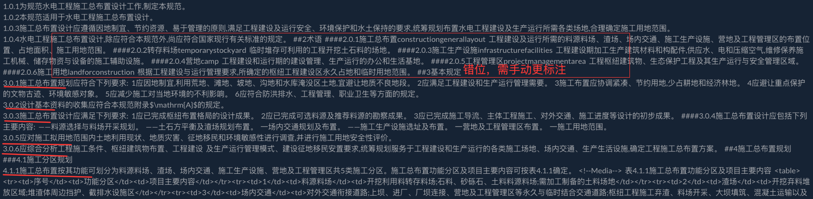
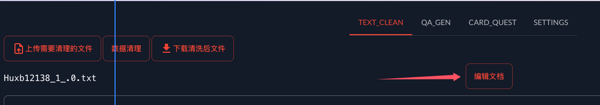
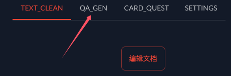
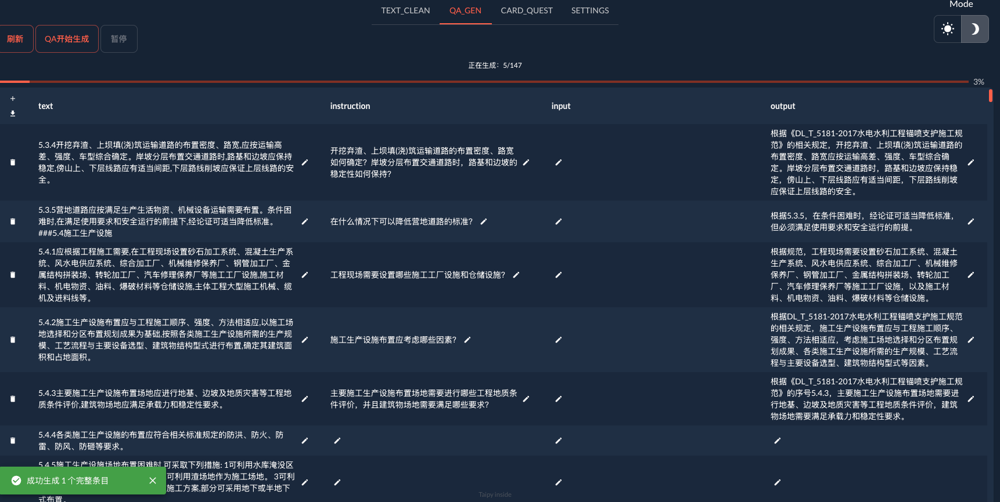

# AutogenQA

# 针对标准规范设计的自动问答对生成兼标注平台

## 简介

---

针对标准规范的特有的文本体系，自动化地对每一条规范进行问答对（标注数据集）生成的平台。

## 快速开始

---

> **请先将各种格式文本转为TXT格式，例如PDF可通过各种工具（Doc2x）转为MD，再直接复制进TXT即可**
> 

> **自备大模型的API，在Setting或者 DG_for_u.py 中修改**
> 

安装依赖包

```jsx
pip install .
```

直接启动 运行 main.py

## 数据清洗

---

点击 `上传需要清理的文件` ，随后点击 `数据清理` 


检查文本是否有多余内容（不需要进行QA生成的内容）

检查文本内容是否符合每行都是完整的内容，若出现一条语句没有在独立的一行，例如



点击 `启用编辑`  ，在编辑完成后点击 `编辑文档`



## QA数据集生成

---

点击 `QA_GEN` 进入QA生成页面



点击 `QA开始生成` 即可开始生成QA问答对，中间的`input`可以根据`Setting`中的**提示词**进行修改来的到想要的结果



点击`暂停`后可以重新点击`QA开始生成`来继续生成

点击后边的`🖊️笔`可以随时修改内容

点击左侧的下载图表可以随时保存当前进度的QA至CSV格式

自己项目做的工具，仍有不少BUG和功能需求在开发中……..

欢迎提交PR